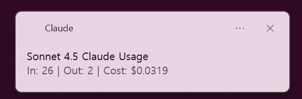

# Worthit

> **Claude CLI hook for displaying token usage and cost notifications across platforms**

Worthit is a lightweight hook for Claude CLI that automatically displays token usage and API costs as native notifications after each conversation. **Worthit tells you how much a task cost, instead of just telling you that it's finished.** Works seamlessly on Windows/WSL, macOS, and Linux.

## Features

- **Multi-platform Support**: Native notifications on Windows/WSL, macOS, and Linux
- **Accurate Cost Tracking**: Real-time cost calculation based on official Claude pricing
- **Multiple Model Support**: Opus 4.5, Sonnet 4.5, and Haiku 4.5
- **Zero Configuration**: Automatic installation and setup
- **Lightweight**: Minimal overhead, no background processes
- **Cache-aware**: Includes prompt caching costs in calculations

## Quick Install

One-line installation for all platforms:

```bash
curl -fsSL https://raw.githubusercontent.com/dukbong/worthit/main/install.sh | bash
```

That's it! The installer will:
1. Detect your platform automatically
2. Download the appropriate script
3. Configure Claude CLI hooks
4. Set up everything for you

## Platform Requirements

### Windows/WSL
- WSL2 with Windows 10/11
- Python 3.6+
- PowerShell (included by default)

**Optional**: Install [BurntToast](https://github.com/Windos/BurntToast) for enhanced notifications:
```powershell
Install-Module -Name BurntToast
```

### macOS
- macOS 10.10+
- Python 3.6+
- Terminal notification permissions

**Setup**: Grant Terminal notification permissions:
```
System Preferences > Notifications > Terminal > Allow notifications
```

### Linux
- Desktop environment with notification support
- Python 3.6+
- `libnotify` (usually pre-installed)

**Installation** (if needed):
```bash
# Ubuntu/Debian
sudo apt-get install libnotify-bin

# Fedora
sudo dnf install libnotify

# Arch Linux
sudo pacman -S libnotify
```

## How It Works

Worthit hooks into Claude CLI's `Stop` event (triggered after each conversation turn) and:

1. Parses the conversation transcript
2. Extracts token usage from the current turn
3. Calculates costs based on the model used
4. Displays a native notification with the results

### Hook Directory Structure

Claude Code recognizes hook scripts from the `~/.claude/hooks/` directory. This directory is the required path for Claude Code hooks configuration.

```
~/.claude/
├── hooks/
│   └── worthit.sh    # hook script
└── settings.json     # hook registration settings
```

> **Note**: Hook scripts must be located in the `~/.claude/hooks/` directory to work properly with Claude Code.

### Notification Format

```
[Model Name] Claude Usage
In: 1,500 | Out: 500 | Cost: $0.0120
```

#### Example

<p align="center">
  
</p>

### Cost Calculation

Worthit includes all cost components:
- Input tokens
- Output tokens
- Cache write tokens (prompt caching)
- Cache read tokens (prompt caching)

## Pricing Information

Current Claude API pricing (as of January 2025):

| Model | Input | Output | Cache Write | Cache Read |
|-------|--------|--------|-------------|------------|
| **Opus 4.5** | $5.00 / 1M | $25.00 / 1M | $6.25 / 1M | $0.50 / 1M |
| **Sonnet 4.5** | $3.00 / 1M | $15.00 / 1M | $3.75 / 1M | $0.30 / 1M |
| **Haiku 4.5** | $1.00 / 1M | $5.00 / 1M | $1.25 / 1M | $0.10 / 1M |

Prices are automatically converted to per-token costs in the calculation.

## Manual Installation

If you prefer to install manually or the automatic installer doesn't work, see [Manual Installation Guide](docs/MANUAL_INSTALL.md).

## Uninstallation

To remove Worthit:

1. Delete the hook script:
   ```bash
   rm ~/.claude/hooks/worthit.sh
   ```

2. Remove the hook from `~/.claude/settings.json`:
   - Open `~/.claude/settings.json`
   - Remove the Worthit entry from `hooks.Stop`

3. (Optional) Restore settings backup:
   ```bash
   mv ~/.claude/settings.json.backup ~/.claude/settings.json
   ```

## Troubleshooting

### No notifications appearing

**Windows/WSL**:
- Ensure PowerShell is accessible from WSL
- Try: `powershell.exe -Command "Write-Host 'test'"`
- Check Windows notification settings

**macOS**:
- Grant Terminal notification permissions
- Test: `osascript -e 'display notification "test" with title "Test"'`

**Linux**:
- Verify notify-send is installed: `which notify-send`
- Test: `notify-send "Test" "Testing"`
- Check if you're in a desktop session with D-Bus

### Python not found

Ensure Python 3 is installed and accessible:
```bash
python3 --version
```

If not installed, install it:
- **Ubuntu/Debian**: `sudo apt-get install python3`
- **macOS**: `brew install python3`
- **Windows/WSL**: `sudo apt install python3`

### Hook not triggering

Verify the hook is registered:
```bash
cat ~/.claude/settings.json | grep worthit
```

You should see an entry like:
```json
{
  "matcher": "*",
  "hooks": [{"type": "command", "command": "/home/username/.claude/hooks/worthit.sh"}]
}
```

## Development

### Testing

Test the script manually:

```bash
export HOOK_INPUT='{"transcript_path": "/path/to/test-transcript.jsonl"}'
echo "$HOOK_INPUT" | ./src/worthit-linux.sh
```

See [tests/](tests/) for sample transcripts.

### Contributing

Contributions are welcome! Please feel free to submit issues or pull requests.

## License

MIT License - see [LICENSE](LICENSE) for details.

## Related Projects

- [Claude CLI](https://github.com/anthropics/claude-code) - Official Anthropic CLI
- [Claude API Documentation](https://docs.anthropic.com/claude/reference/getting-started-with-the-api)

## Acknowledgments

Built for the Claude CLI community. Special thanks to Anthropic for creating Claude and the powerful CLI tool.

---

**Made with** ❤️ **by** [dukbong](https://github.com/dukbong)

**Support**: [Report Issues](https://github.com/dukbong/worthit/issues) | [Discussions](https://github.com/dukbong/worthit/discussions)
